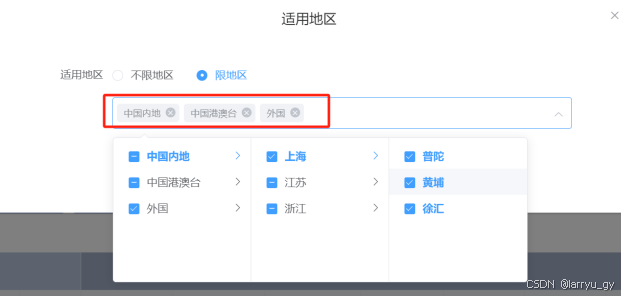

# el-cascader连级选择器只回显根节点元素，且重复只显示一次  

## 效果图
  
之前在做开发时，遇到一个特殊需求是el-cascader连级选择器只回显根节点的元素，且重复的只显示一次，如下图所示，他要显示的不是具体的省份曲线，而是中国内地/港澳台/外国时，可以通过下面自己封装监听选择方法来实现回显的标签及样式。

## templete部分
```js

	<el-cascader class="mgr-300" style="width: 600px;"
	  ref="myCascader"
	  :props="props"
	  :options="options"
	  v-model="selectedOptions"
	  @change="handleChangeNodes('myCascader')"
	  expand-trigger="hover"
	  :show-all-levels="true"
	  :checkStrictly="true"
	  clearable
	  filterable
	  separator=" / "
	  clearable>
	</el-cascader>
```
## data部分
```js
	data() {
	      return {
	        // 测试数据开始
	        selectedOptions: [],
	        selectedFirstLevels: [],
	        props: { 
	          multiple: true,
	          checkStrictly: false,
	        },
	        options: [{
	          value: 1,
	          label: '中国内地',
	          children: [{
	            value: 2,
	            label: '上海',
	            children: [
	              { value: 3, label: '普陀' },
	              { value: 4, label: '黄埔' },
	              { value: 5, label: '徐汇' }
	            ]
	          }, {
	            value: 7,
	            label: '江苏',
	            children: [
	              { value: 8, label: '南京' },
	              { value: 9, label: '苏州' },
	              { value: 10, label: '无锡' }
	            ]
	          }, {
	            value: 12,
	            label: '浙江',
	            children: [
	              { value: 13, label: '杭州' },
	              { value: 14, label: '宁波' },
	              { value: 15, label: '嘉兴' }
	            ]
	          }]
	        }, {
	          value: 17,
	          label: '中国港澳台',
	          children: [{
	            value: 18,
	            label: '中国港澳台',
	            children: [
	              { value: 19, label: '中国香港' },
	              { value: 20, label: '中国澳门' },
	              { value: 21, label: '中国台湾' },
	            ]
	          }]
	        }, {
	          value: 24,
	          label: '外国',
	          children: [{
	            value: 25,
	            label: '全部国外',
	          }]
	        }],
	      }
	    }

```

## functions部分
```js
	// 监听选择改变的方法
	handleChangeNodes(value) {
		let checkedNodeList = this.$refs.myCascader.getCheckedNodes();
		console.log(checkedNodeList, "checkedNodeList");
		checkedNodeList = checkedNodeList.filter(
		  (item) => !(item.parent && item.parent.checked)
		);

	this.$nextTick(() => {
	  let tagListBox = this.$refs.myCascader.$el.children[1]
	  if(!checkedNodeList.length){
		tagListBox.innerHTML = "";
		return;
	  }
	  let dom = "";
	  let selectedArr = [];
	  tagListBox.innerHTML = "";
	  checkedNodeList.forEach((item, index) => {
	    // 重复的根节点元素只呈现一次就行
		if (selectedArr.indexOf(item.pathNodes[0].label) <= -1) {
		  let spanA = document.createElement("span");
		  spanA.className = "el-tag el-tag--info el-tag--small el-tag--light";
		  let spanB = document.createElement("span");
		  spanB.innerText = item.pathNodes[0].label;
		  selectedArr.push(item.pathNodes[0].label);
		  let iC = document.createElement("i");
		  iC.className = "el-tag__close el-icon-close";
		  iC.onclick = (e) => this.delCascaderTag(e, item,tagListBox);
		  spanA.appendChild(spanB);
		  spanA.appendChild(iC);
		  tagListBox.appendChild(spanA);
		}
	  });
	});
	},
	// 删除系统配置的标签显示
	delCascaderTag(el, info, box) {
	  let child = el.target.parentNode;
	  box.removeChild(child);
	  let arr = JSON.parse(JSON.stringify(this.val));
	  arr = arr.filter((item)=>{
	    let flag = item.findIndex(el=> el == info.value);
	    return flag == -1;
	  })
	  this.val = arr;
};

```