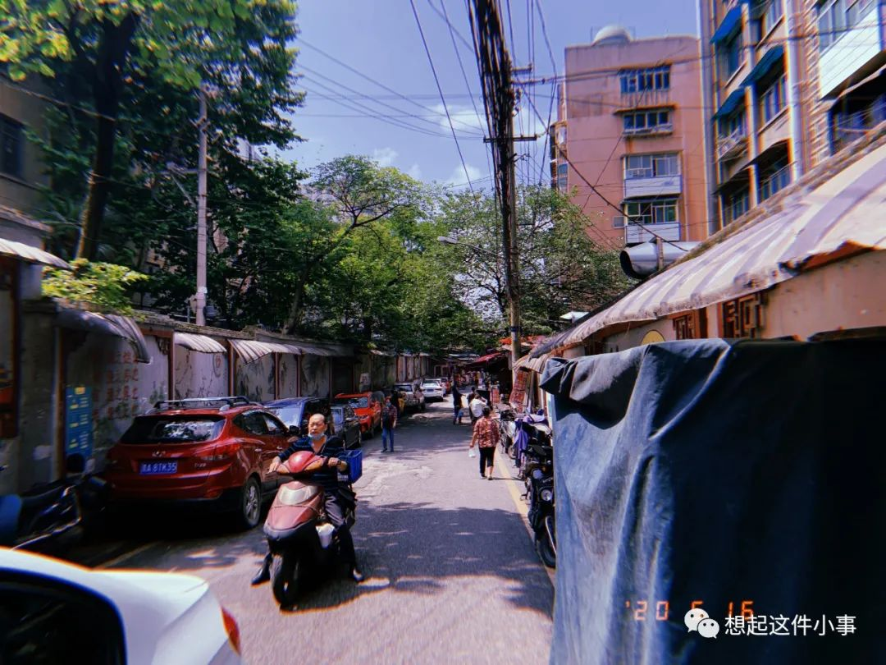
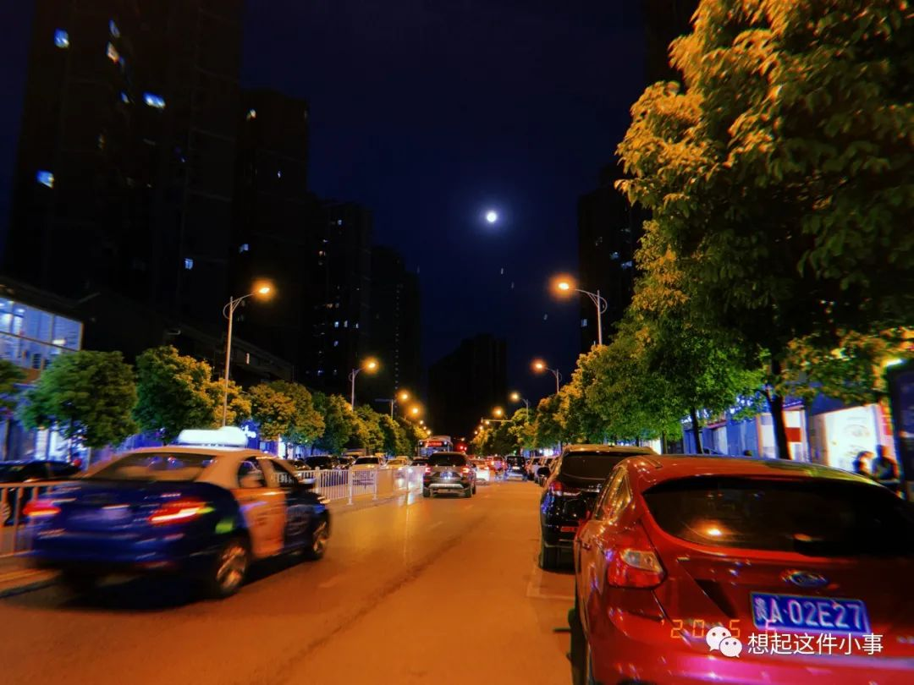

## 山阴路的夏天  

> [!IMPORTANT]
>
>  这次你离开了没有像以前那样说再见，再见也他妈的只是再见   
>  我们之间从来没有想象的那么接近，只是两棵树的距离   
>  你是否还记得山阴路我八楼的房间，房间里唱歌的日日夜夜   

> [!IMPORTANT]
>
>  那么热的夏天你看着外面，看着你在消逝的容颜   
>  我多么想念你走在我身边的样子，想起来我的爱就不能停止   
>  南京的雨不停地下不停地下，就像你沉默的委屈   

> [!IMPORTANT]
>
>  一转眼，我们的城市又到了夏天，对面走来的人都眯着眼   
>  人们不敢说话不敢停下脚步，因为心动常常带来危险   
>  我多么想念你走在我身边的样子，想起来我的爱就不能停止   

> [!IMPORTANT]
>
>  南京的雨不停地下不停地下，有些人却注定要相遇   
>  你是一片光荣的叶子落在我卑贱的心   
>  像往常一样我为自己生气并且歌唱   
>  那么乏力，爱也吹不动的叶子  

